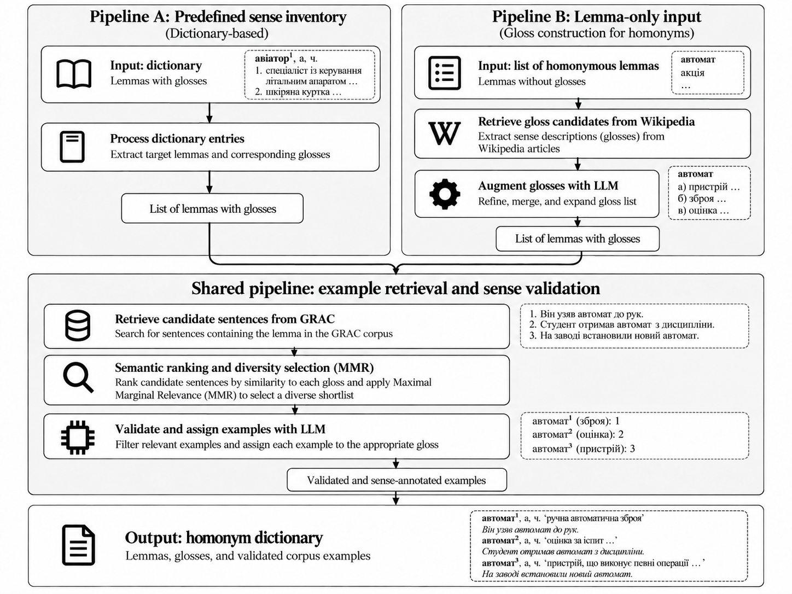

# Ukrainian Homonym Dictionary Pipeline

Build a sense-aware Ukrainian homonym dictionary with examples from the [General Regionally Annotated Corpus of Ukrainian (GRAC)](https://uacorpus.org/en). The project supports an existing sense inventory or a list of lemmas that need candidate senses.



## How it works

- **Dictionary input:** normalize homonyms and their supplied sense definitions.
- **Lemma-only input:** collect candidate senses from Ukrainian Wikipedia and refine them with an LLM.
- **Shared pipeline:** retrieve GRAC sentences once per lemma, rank them against each sense definition with embeddings, select up to 20 diverse candidates per sense with maximal marginal relevance, and validate them with an LLM. Keep up to five accepted examples per sense.

The published [Ukrainian WSD Benchmark](https://huggingface.co/datasets/yuriilaba/ukrainian_wsd_benchmark) comes from the dictionary workflow. It contains 1,386 lemmas, 3,206 senses, and 13,310 corpus examples.

## Quick start

Requires Python 3.11+, [uv](https://docs.astral.sh/uv/), an `OPENAI_API_KEY`, and access to GRAC. Install dependencies and set the API key in your environment, then run either workflow from the repository root:

```bash
uv sync

# Dictionary with predefined senses
uv run python scripts/run_baseline.py \
  --input ukrainian_homonym_dictionary.json \
  --output outputs/baseline

# Plain UTF-8 file with one lemma per line
uv run python scripts/run_wikipedia_augmented.py \
  --input lemmas.txt \
  --output outputs/lemma_only
```

Edit [config.yaml](config.yaml) to change retrieval, ranking, and validation settings. To retrieve GRAC sentences without an OpenAI key:

```bash
uv run python scripts/retrieve_grac.py \
  --lemma автомат --max-examples 20 \
  --output outputs/grac/automat.json
```

## Output

Each run writes these files under its `--output` directory:

- `final/homonym_dictionary.json`: dictionary with sense definitions, accepted examples, and provenance.
- `final/huggingface.jsonl`: one row per sense with `lemma`, `gloss`, and example sentences.
- `run_manifest.json` and `statistics/pipeline_statistics.json`: run settings, status, and counts.

GRAC candidates, rankings, validation decisions, and failure records are retained in the same output directory for inspection and resuming a run. The released benchmark includes additional GRAC metadata and is available on [Hugging Face](https://huggingface.co/datasets/yuriilaba/ukrainian_wsd_benchmark).
